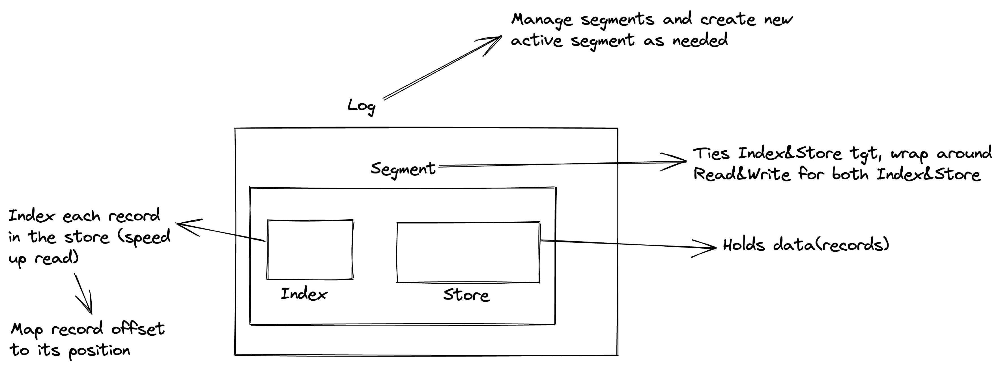
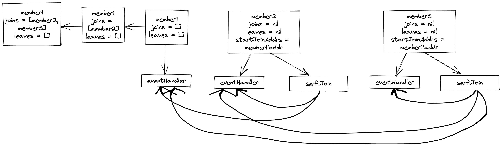
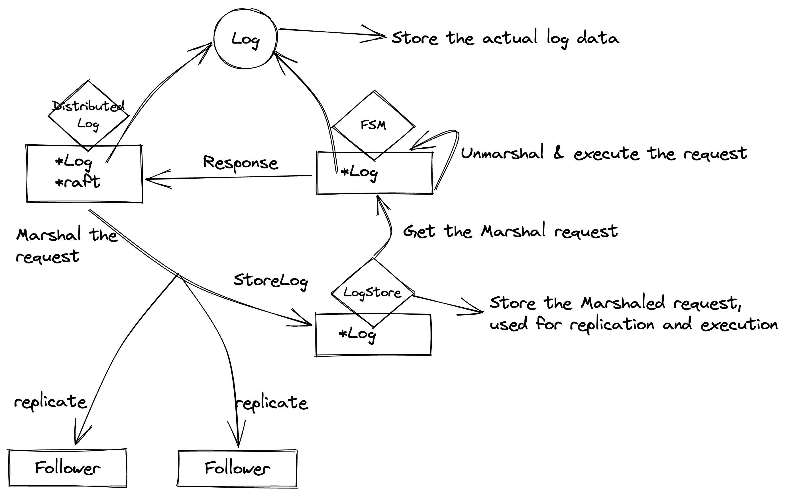
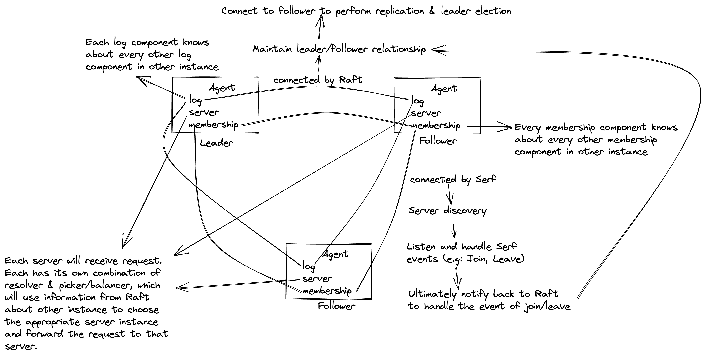

# Proglog

## Background

- This is a Golang application that follow the instruction from [this book](https://pragprog.com/titles/tjgo/distributed-services-with-go/) to build a distributed log services.

## NOTES
Offset refers to the logical location of the entry in the file. E.g: if we have 2 entry entry0 & entry1, then entry0 would be at offset 0 and entry1 would be at offset1
Pos refers to the actual location of the entry in the file, representing by bytes
E.g: if we have 2 entry entry0 and entry1, each consists of 8bytes. Then entry0 would be at pos=0 and entry1 would be at pos=8

## Components
### CommitLog
- Consists of 4 components: **Store** and **Index** as the core, with **Segment** wrapped around, and **Log** as the outermost component
    - **Store** is the most important component where it has a pointer to a file where the actual data(records) is saved.
    - **Index** is used to speed up read operation, where it holds pairs of *offset* and *position* so we can jump straight to the actual record's location instead of having to iterate through the file. **Store** and **Index** are 2 files that go in pair, so if one is full, then both get replaced.
    - **Segment** is an abstraction around **Store** and **Index**, each **Segment** only have 1 pair of **Store** and **Index**. Whenever we need to interact(create/append/read/delete/etc) with **Store** and **Index**, we can use the **Segment** so that we only have to interact with 1 entity instead of 2.
    - **Log** manages a list of **Segments**, consist of a list of *old segment* and 1 *active segment* where data is actively being written to. When the **Store** or **Index** that the active segment manages is full (reach the pre-configured size), the **Log** will handle create a new **Segment**(with new **Store** and **Index**) and assign that new one as the *active segment* while the previous one got pushed into the list of *old segment*. Each **Segment** holds a varible *baseOffset* where the **Log** can use to determine which **Segment** to read from.

### Server

### Membership
- A component that handles server to server discovery using [Serf](https://www.serf.io/).
- Every instance will be managed by a Serf cluster and whenever there is a new insance joining or leaving the cluster, Serf ensure that every other instance in the cluster knows about this.
- Each Serf instace uses the *startJoinAddrs* to determine which cluster to join.
- Every instance in the cluster knows about the current state of the cluster (number of current working instance, which instance just joined/left, etc) at all times.
- The below flow demonstrate the flow used in [unit test](./internal//discovery//membership_test.go).

### Raft/Distributed Log
- We use **Raft** to create a *leader/follower* relationship between multiple servers.
     - The leader will be the one actively listening and executing request
     - All the follower will just replicate/store the request received from the leader without doing any actual work.
     - When the leader is lost, all the follower will start a leader election process to vote a new leader.
- We create a **DistributedLog** components that wraps around our **CommitLog** and **Raft**.

- There more components in **Raft** such as *Snapshot*, *StableStore*, *StreamLayer*, *Transport* but the diagram only depicts the main execution flow (this is what happens during the *raft.Apply()* method).
- The **DistributedLog** component also acts a *Serf handler*, which implements the *Join* and *Leave* method, [here](./internal/log/distributed.go).
    - So whenever **Serf** receives a *Join* event telling that a new node just joined the cluster, it will notify back to **Raft** to start the *leader election* and *log replication* process. 

### Agent
- Exports an **Agent** that manages the different components and processes that make up the services (*membership*, *log/distributed log*, and *server*).
- We can just use the **Agent** to boot up the whole service instead of having to configuring each components.
- Each **Agent** will contain a *multiplexer* to distinguish between **Raft** request and **gRPC** request.
- Each **Agent** will contain only 1 combination of *Serf membership*, *distributed log/Raft*, and *server*. Multiple **Agents** create a *cluster* in which *Serf* and *Raft* show its effect.

- The *log* in this diagram refers to the **Distributed Log**.
- The diagram shows the high level architecture with 1 *Leader* instance and 2 *Follower* instances and how each component in **Agent** works together and with other **Agent** instances.

## TODO
+ Understand gommap
+ Understand enc ?
+ Read more on Casbin
+ Read more on Serf
+ Read more on Raft
+ Read more on CMUX (what is the difference between Raft and gRPC request, when does each get called?)
+ Read more on GPRC's Resolver and Picker