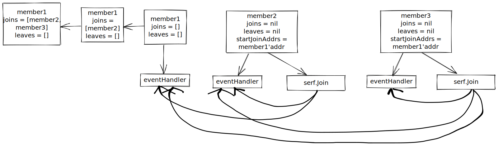

# Proglog

## Background

- This is a Golang application that follow the instruction from [this book](https://pragprog.com/titles/tjgo/distributed-services-with-go/) to build a distributed log services.

## NOTES
Offset refers to the logical location of the entry in the file. E.g: if we have 2 entry entry0 & entry1, then entry0 would be at offset 0 and entry1 would be at offset1
Pos refers to the actual location of the entry in the file, representing by bytes
E.g: if we have 2 entry entry0 and entry1, each consists of 8bytes. Then entry0 would be at pos=0 and entry1 would be at pos=8

## Components
### CommitLog
- Consists of 4 components: **Store** and **Index** as the core, with **Segment** wrapped around, and **Log** as the outermost component
    - **Store** is the most important component where it has a pointer to a file where the actual data(records) is saved.
    - **Index** is used to speed up read operation, where it holds pairs of *offset* and *position* so we can jump straight to the actual record's location instead of having to iterate through the file. **Store** and **Index** are 2 files that go in pair, so if one is full, then both get replaced.
    - **Segment** is an abstraction around **Store** and **Index**, each **Segment** only have 1 pair of **Store** and **Index**. Whenever we need to interact(create/append/read/delete/etc) with **Store** and **Index**, we can use the **Segment** so that we only have to interact with 1 entity instead of 2.
    - **Log** manages a list of **Segments**, consist of a list of *old segment* and 1 *active segment* where data is actively being written to. When the **Store** or **Index** that the active segment manages is full (reach the pre-configured size), the **Log** will handle create a new **Segment**(with new **Store** and **Index**) and assign that new one as the *active segment* while the previous one got pushed into the list of *old segment*. Each **Segment** holds a varible *baseOffset* where the **Log** can use to determine which **Segment** to read from.

### Server

### Membership
- A component that handles server to server discovery using [Serf](https://www.serf.io/).
- Every instance will be managed by a Serf cluster and whenever there is a new insance joining or leaving the cluster, Serf ensure that every other instance in the cluster knows about this.
- Every instance in the cluster knows about the current state of the cluster (number of current working instance, which instance just joined/left, etc) at all times.
- The below flow demonstrate the flow used in [unit test](./internal//discovery//membership_test.go).

### Replicator
- We store multiple copies of the log data when we have multiple servers in a Serf cluster, making our servcies more resillient to failures.
- When servers discover other servers, we want to trigger the servers to replicate.
- Our replication will be pull-based, with the replication component consuming from each discovered server and producing a copy to the local server.

### Agent
- Exports an Agent that manages the different components and processes that make up the services(replicator, membership, log, and server).
- We can just use the Agent to boot up the whole service instead of having to configuring each components.

## TODO
+ Understand gommap
+ Understand enc ?
+ Understand os.Truncate
+ Understand TLS and CA cert
+ Understand Casbin
+ Understand Serf
+ Review server implementation and add to README